# Sustainable Timber Co. 

It's time to really celebrate and support businesses that have the environment at the heart of their products. Sustainable Timber Co. is owned and run by Johan Johansson, a highly creative person with a small forest and sawmill.

For Johan the nature is important and every tree has a story. Based in the north of Swedish, his method of forestry ensures that the nature remains unharmed and that every tree removed is removed for a good reason. As a result Johan only removes a small number of trees each year and the price of those trees must be of a premium. 

Johan is able to custom mill the trees to exactly what his customers require. Customers like instrument builders, furniture makers and timber-frame house renovators. 

Johan is part of the team. Solving a problem for his customers. What better way to do this than a custom built online enquiry system that allows users to specifically detail what they need and when they need it. Giving Johan the information he needs to really offer his customers a unique and premium experience.  

***

## Contents
### [Design Thinking](#design-thinking-1)
- [Video Proposal](#video-proposal)
- [The Company](#the-company)
- [Knowing the customer](#knowing-the-customer)
- [Persona](#persona)
- [Brainstorm](#brainstorm)
- [Wireframes](#wireframes)
- [Planning & Design](#planning--design)
### [Agile](#agile-1)
- [User Stories and Agile](#user-stories--agile)
- [Story points and Sprints](#story-points--sprints)
- [Epics into User stories](#epics-into-user-stories)
### [Features](#features-1)
- [Existing Features](#existing-features)
    - [Navigation](#navigation)
    - [Website](#website)
    - [Enquiry System](#enquiry-system)
    - [Johan at the centre](#johan-at-the-centre)
- [Future Features](#future-features)
### [Testing](#testing-1)
- [Manual Testing](#manual-testing)
- [Automated Testing](#automated-testing)
### [Bugs](#bugs-1)
- [Solved](#solved)
- [Unsolved](#unsolved)
### [Deployment](#deployment-1)
- [Deployinig to Heroku](#deploying-to-heroku)
- [Database Setup](#database-setup)
- [Cloudinary](#cloudinary)
### [Credits & Acknowledgments](#credits-and-acknowledgements)
- [Credits](#credits)
- [Acknowledgements](#acknowledgements)

***

## Design Thinking

### Video Proposal
I created a proposal video. This would be presented to owners or investors.

[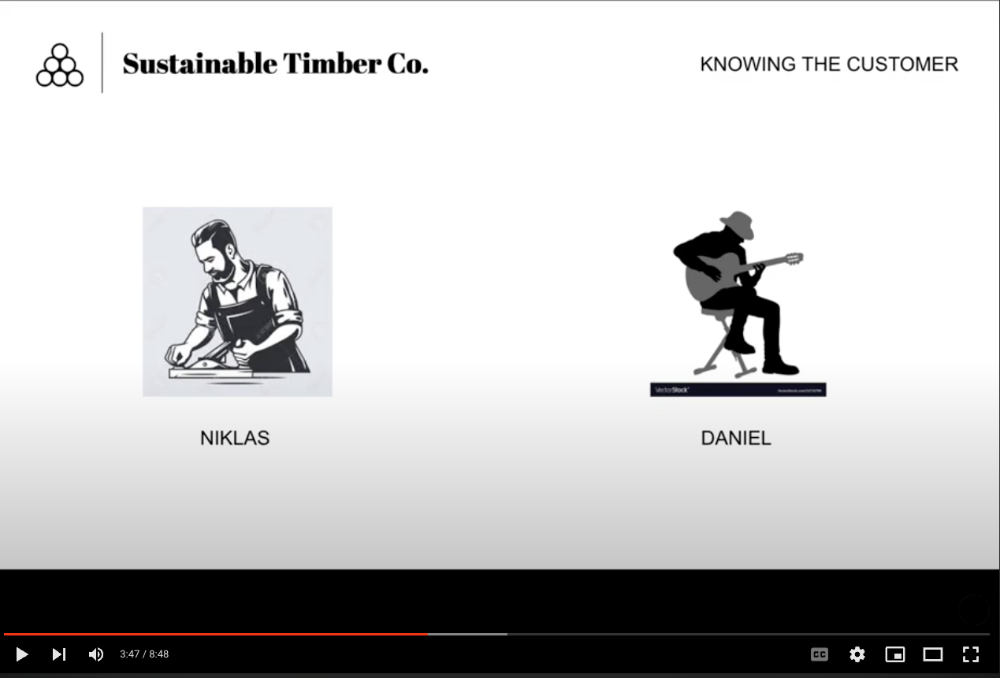](https://youtu.be/HH_DNE370Mw)

### The company
This is based on a real-life company in the North of Sweden. For these small sawmills it is currently hard for them to connect with customers, without having a custom made website and backend. Often enquires and communications are done via Facebook or some-kind of primitive local online market place. 

### Knowing the customer
I spoke with a number of people that worked with wood. Daniel and Niklas stood out as the kind of people that would use a custom milled timber company. 

There results are below, with keywords highlighted in red text.

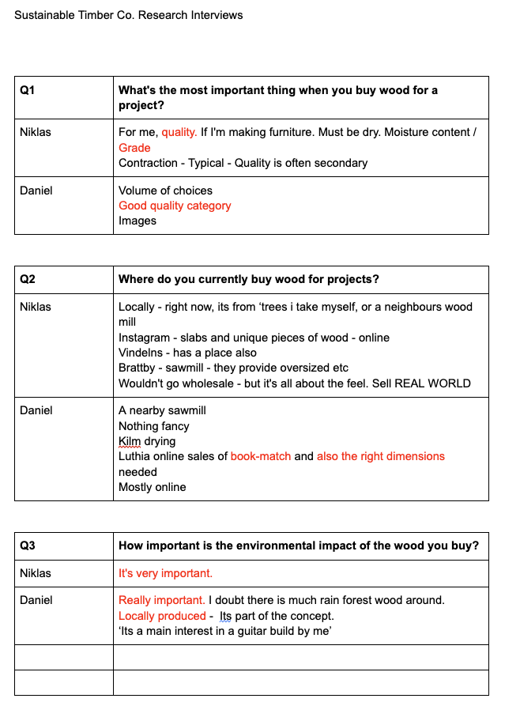

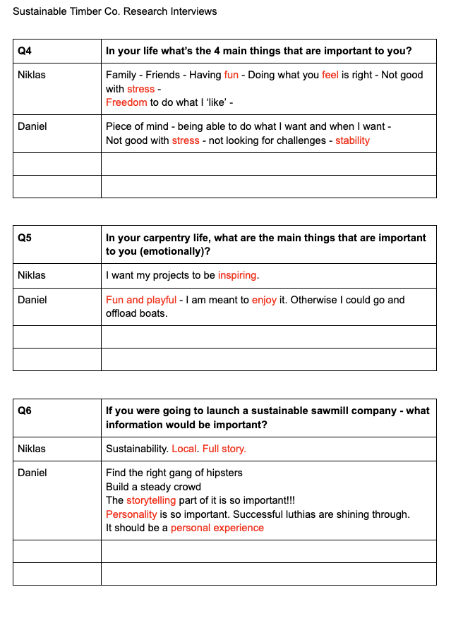

### Persona 
The projects - Persona
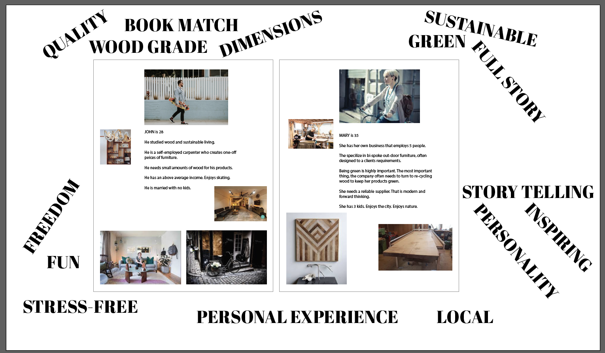

### Brainstorm
Brain Storm 1 - General ideas for the website

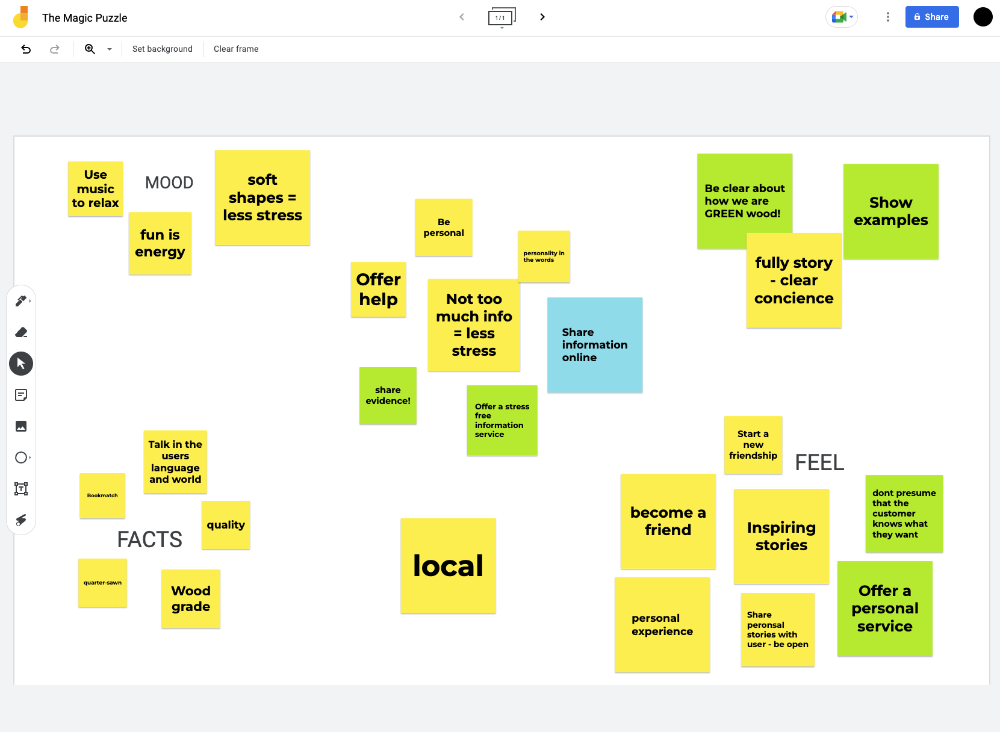

Brain Storm 2 - Focusing in on viable ideas

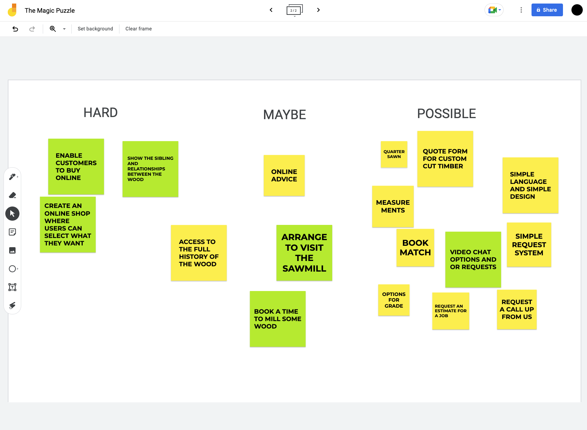

### Wireframes
Below is an example of my original wireframes for this project. You can see that the final website evolved from these first concepts of how the website would look.
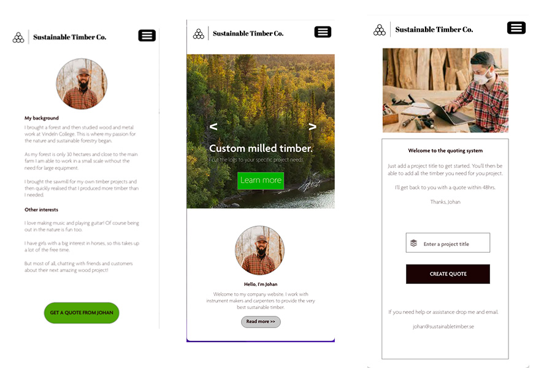

### Planning & Data Schema
My original plan was to use two databases. One containing quotes and the other containing items that would sit within quotes. Allowing the user to request a number of items within a single quote.

After trying this in production I came across the problem of tieing together the quote ID to the Items database. This felt a little too advanced for this project as so I simplified the idea to one database. The user could still make multiple enquires, but it would be contained in one database. This felt more realistic given my skill level and the time allocated for the project.

Below is the database model I switched to using for the project.

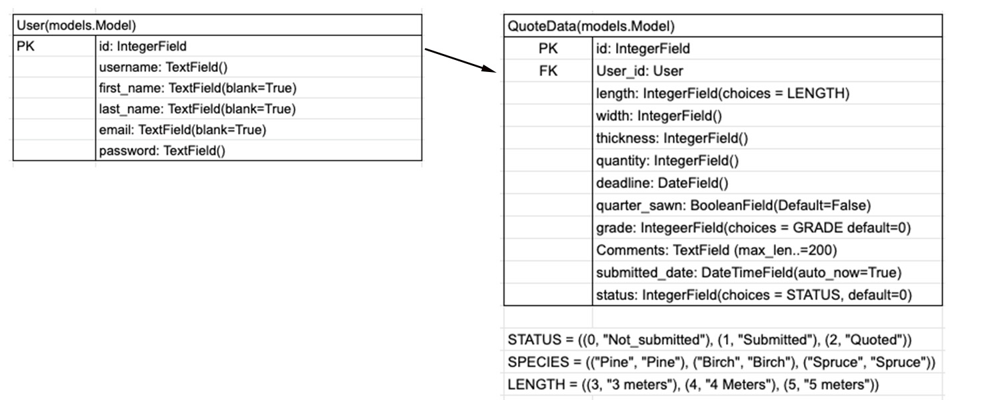

### How the database works
||What happens|Reaction|
|--|--|--|
|1|User creates login|user information stored in Django Users database|
|2|User completes an enquiry form and saves|Users ID is added when saved|
|||Status is set to 'not submitted'|
|||Submitted date/time is automatically saved|
|3|user updates enquiry|Relevant fields are updated|
|||Submitted data/time is automatically updated|
|4|User submits form|Status is changed to 'Submitted'|
|||Submitted date/time is automatically updated|
|5|Admin (superuser) changes status to 'quote emailed'|Submitted date/time is automatically updated|

### Design
The website is designed to give the user the experience they expect from a website. The website design should not challenge the user in any way - They shouldn't visit the site and be 'impressed by the design' - the site design should go un-noticed - something running in the background - it shouldn't enter their mind. 

I designed the homepage so the user will take in these key elements
- The swedish flag ( the location of the company )
- image of trees ( the hero image )
- 'nature first' ( the message of the company )
- 'custom timber' ( what the company offers )

These are the important messages that a potential customers will need. Simple. At home. Not intimidating. 

Once this core message has been conveyed the next detail they will see is Johan's signature. This is key to building the users trust. We asking the user to make the effort to sign up and fill in a form. For them to do this they will need to trust the site and trust that the man behind the site is the one that can help them.

The flow of the website is all around the user being 3 clicks away from the Enquiry System. Every jounrey the user takes will lead them to Enquiry System.

***

## Agile

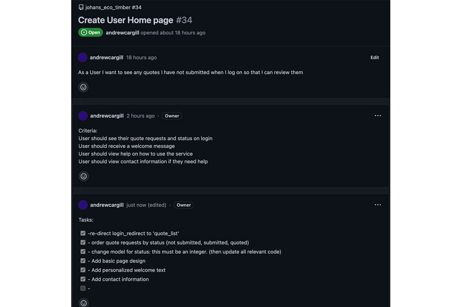

### User Stories & Agile

[Link to the Github Project used in this project](https://github.com/users/andrewcargill/projects/7)

I generated over 100 user stories in the development of this project. I made use of the 'project' feature within GitHub to manage the ordering and completion. 

User Stories were very useful during development as they allowed me to closely track progress. I discovered that using tick-boxes for each 'task' really helped monitor the completion of a user story.

### Story Points & Sprints

My allocation and valuing of story points moved a little as the project progressed. I completed my first sprint and re-assessed the value of 1 story point - After the first week of development I was confident on the value of one story point. For me this was a User Story that I knew how to complete and required little background research. 

Sprint lengths changed depending on my work/ study hours for that day or week of production. This would be much easier with a standard 40hr week, but I did feel that it was useful to apply sprints to my work even when working alone and studying as I do, as it helped me set goals for sections of the projects development.

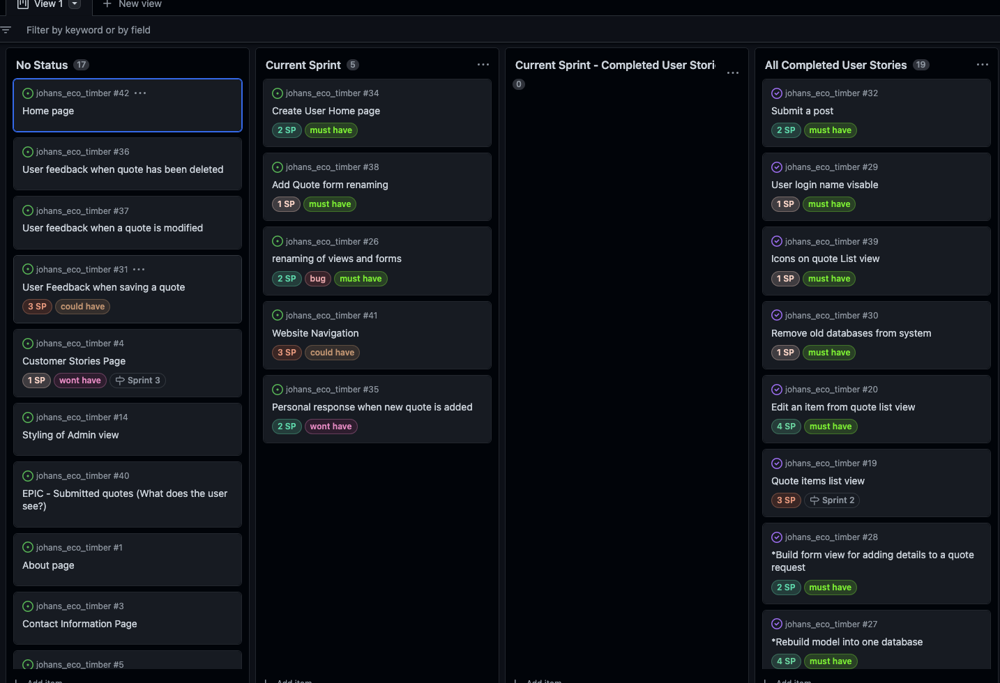

### Epics into User Stories

Below is an example of how I turned an epic into User Stories. 

| Epic       | User Stories          |
| ------------- |-------------|
| [Final Design - EPIC](https://github.com/andrewcargill/johans_eco_timber/issues/44)    | [Calendar](https://github.com/andrewcargill/johans_eco_timber/issues/80)  |
||[Redirect on login](https://github.com/andrewcargill/johans_eco_timber/issues/77)    |
||[Hero Image text](https://github.com/andrewcargill/johans_eco_timber/issues/72)    |
||[Optimal image sizes](https://github.com/andrewcargill/johans_eco_timber/issues/73)    |
||[Copyright icon](https://github.com/andrewcargill/johans_eco_timber/issues/74)    |
||[Fix mobile design for specific pages](https://github.com/andrewcargill/johans_eco_timber/issues/75)    |
||[Change 'register' to 'signup'](https://github.com/andrewcargill/johans_eco_timber/issues/76)    |
||[Capitalize user name when displayed](https://github.com/andrewcargill/johans_eco_timber/issues/78)    |
||[Explore information container background color](https://github.com/andrewcargill/johans_eco_timber/issues/79)    |
||[Align Navigation](https://github.com/andrewcargill/johans_eco_timber/issues/45)    |
||[Navigation fixed to top of screen](https://github.com/andrewcargill/johans_eco_timber/issues/70)    |
||[Favicon](https://github.com/andrewcargill/johans_eco_timber/issues/33)    |

***

## Features

### Existing Features

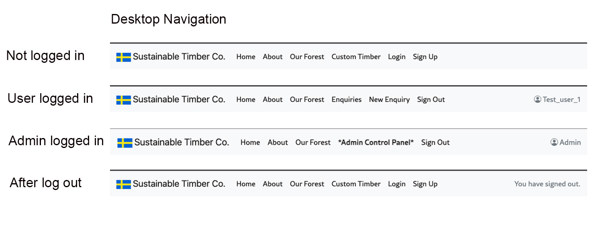
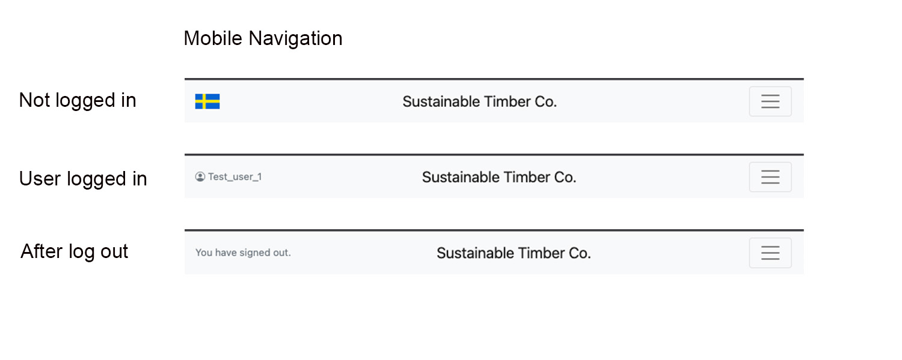
#### Navigation

- Responsive design
- Displays custom menu for logged in user
- Display custom menu for Admin (Superuser)
- Displays status of user login - logged out

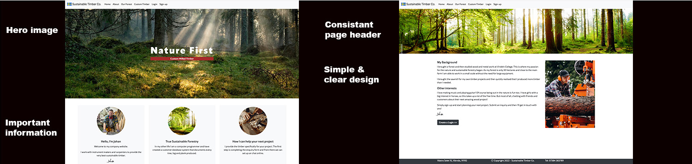
#### Website

- Responsive design
- Simple information
- Clearly displaying 'Johan' to build customer trust

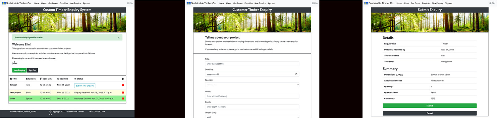
#### Enquiry System

- Responsive design
- User can create an enquiry
- User can edit an enquiry
- User can submit an enquiry
- User can delete an enquiry
- Admin can update the status to 'emailed'. This will reflect in users view

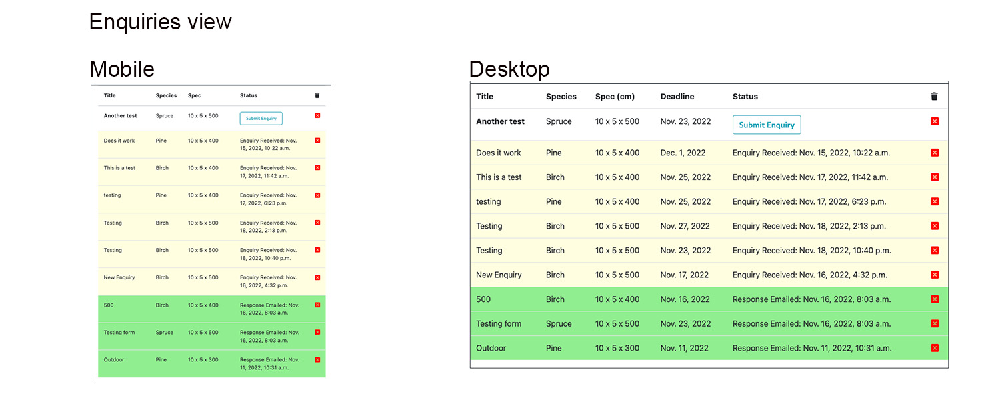

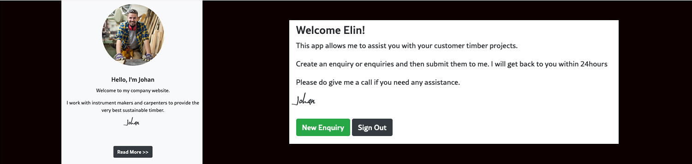
#### Johan at the centre

- This is used though-out the website as a way of promoting a personal experience and personal service to the user.

### Future Features
- Email response system for Admin
- Contact form on main website (access without login)
- Online shop (So that company can advertise timber they have for sale)
- Online chat
- Enquiry form could evolve into online chat/video booking system

***

## Testing

### Code testing

All python code was checked with Pycodestyle & [Code Institute Python Checker](https://pep8ci.herokuapp.com/)

HTML and CSS code has passed validation checks.

Lighthouse report - Index.html

Lighthouse report - About.html
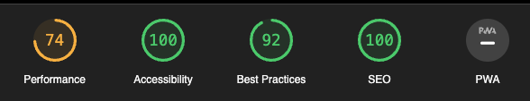
- the main problems reference the CSS files not being local
(I was advised by a tutor to keep the CSS files as CDN)

### Manual Testing 

| Page        | Description           | Result  |
| ------------- |-------------| -----|
| Index.html    | About button | Pass |
|      | Responsive Design - Mobile > Large      |   Pass |
|      | Hello, I'm Johan Link      |   Pass |
|  | True Sustainable Forestry Link      |Pass |
||How I can help... Link|Pass|
||Take only the trees... Link|Pass|
||That creatuve... link|Pass|
|About|Responsive design - Mobile > Large|Pass|
||Link test|Pass|
|Forest|Responsive Design - Mobile > Large|Pass|
||Link test|Pass|
|Customer Timber|Responsive Design - Mobile > Large|Pass|
||Link test|Pass|
|Login|Log in with Username & Password|Pass|
||Login with incorrect details (help text)|Pass|
||Link to 'sign up' test |Pass|
||Successful login - User to 'quote_list' with username displayed |Pass|
||Successful login - Admin to 'quote_list' with username displayed |Pass|
|Sign up| Sign up with correct information |Pass|
||Sign up with incorrect info (help text)|Pass|
||Test 'sign in' link|Pass|
|Enquiry (list view)|Responsive Design - Mobile > Large|Pass|
||New enquiry button loads new enquiry form|Pass|
||Sign out button loads sign out confirmation view|Pass|
||(Unsubmitted) Delete button loads delete confirmation view|Pass|
||(Submitted) Delete button loads delete confirmation view|Pass|
||(Email sent) Delete button loads delete confirmation view|Pass|
||Scrolling for many items|Pass|
|New Enquiry form|Responsive Design - Mobile > Large|Pass|
||Completed form - submit button - saves and loads list view|Pass|
||Uncompleted form - submit button - help text shown|Pass|
||Cancel button - User returned to list view|Pass|
||Datepicker - Loads when clicked|Pass|
||Number fields - Only except numbers|Pass|
||Comment field allows for large string|Pass|
|Submit form view|Responsive Design - Mobile > Large|Pass|
||Displayed details match the record being submitted|Pass|
||Submit button - changes status of enquiry and loads list view|Pass|
||Cancel button - Enquiry remains unsubmitted - loads list view|Pass|
|Delete view|Responsive Design - Mobile > Large|Pass|
||Delete button - Loads list view and removes the enquiry|Pass|
||Cancel button - Loads list view and enquiry remains in list|Pass|
|Edit Enquiry|Responsive Design - Mobile > Large|Pass|
||Save changes button updates enquiry|Pass|
||Cancel button returns user to list view|Pass|
||Incorrect changes - Help text shown|Pass|
|Alert Box|Alert shown after enquiry saved|Pass|
||Alert shown after enquiry edited|Pass|
||Alert shown after enquiry submitted|Pass|
||Alert shown after user logs out|Pass|
|User status|Not shown when user is not logged in|Pass|
||Displays users name when logged in|Pass|
||Confirms user has logged out - after logout|Pass|
|Navigation|Responsive Design - Mobile > Large|Pass|
||Home links to index.html|Pass|
||About links to about.html|Pass|
||Out forest links to outforest.html|Pass|
||Custom timber links to about_enquiry_system.html|Pass|
||Login links to accounts/login/|Pass|
||Sign up links to /accounts/signup/|Pass|
||User Logged in - Enquires links to quote_list.html|Pass|
||User logged in - New Enquiry links to new_enquiry.html|Pass|
||User logged in - Log out links to accounts/logout/|Pass|
||Admin logged in -Admin control panel links to /admin |Pass|
||Admin logged in - Log out links to accounts/logout/|Pass|
|Admin view|Admin changes status to emailed - Updates list view|Pass|

### Automated Testing
To date no Automated testing has been carried out.

***

## Bugs

### Solved

#### Bootstrap & Materialize

I had zero experience of either of these going into the project and as both were used in the walkthroughs I thought they were equals. I had chosen to go with Materialize. This backfired when I was trying to format the form, and I was then informed by a tutor that Materialize was seen as very dated and that I could experience problems with Django should I choice to continue working with it. 

As this project involves many elements I found that I didn’t really have the time to focus and learn the true powers of Bootstrap. But I think the finished site is fine, given my level of knowledge and experience with Bootstrap.

#### Power of Agile

I needed to change direction on the enquiry system implementation. My original plan was to allow the user to create an enquiry, add a number of items to that enquiry and then submit the enquiry. At the stage where I had the database models installed and was trying to solve the problem of including items within the enquiry I realised that this was maybe a little ambitious for this project.

I decided to simplify the idea into one database which would enable the user to create an enquiry and then submit the enquiry. The system would allow the user to create and submit any number of enquires. 

#### Deployment

I spent a few hours working with Rebecca (Tutor) to help me get the site live. I had placed the 'static' files in the wrong directory and also had a problem with Cloudinary collecting the static files. 

#### Placement of the user status
Originally I had the user status shown under the navigation. I spent many hours trying to find a solution that would work for both desktop and mobile views. The solution I developed shows the Status on the right hand side for desktop views and then moves the status to the left on mobile views. I think it's a brilliant and creative solution to the problem.

### Unsolved
- Data picker only allows user to select future dates
- UTC - Standard time - I have not tested for time adjustments for locations other than Sweden. The website is intended for swedish users, so I do not think this is a major problem at this stage.
- 500 error - At the moment if a user is not logged in and tries to access a 'restricted' page they will get a 500 error. This should be fixed by adding a redirect.

***

## Deployment

### Deploying to Heroku & ElephantSQL & Cloudinary
- Create a Cloudinary account
- Create an account in Heroku
- Create an app in Heroku
- Give app a name and select region
- Create n account and database in ElephantSQL

### Database setup
- In your Heroku App goto 'settings'
- click on 'Reveal Config Vars'
- Add SECRET_KEY and add a value
- Add CLOUDINARY_URL and past in the url from your Cloudinary account
- add DATABASE_URL and past in the url from ElephantSQL
- Click on 'Deploy'
- Link up the repository via github
- Manually deploy

***

## Credits and Acknowledgements

### Credits

This project was created and programmed by myself.

|||
|---|---|
|Images|[freepik](https://www.freepik.com/free-photos-vectors/carpenter-carpentry-woodworking)|

### Acknowledgements

|Description|Link|
|----|----|
|Working with Admin urls|[stackoverflow](https://stackoverflow.com/questions/44130643/django-admin-urls)|
|Adding user ID to database|[stackoverflow](https://stackoverflow.com/questions/9269945/how-do-i-pass-the-current-user-id-as-a-hidden-field-in-a-django-form )|
||[Django](https://docs.djangoproject.com/en/4.1/ref/forms/fields/)|
||[airbrake](https://blog.airbrake.io/blog/http-errors/301-moved-permanently)|
||[testdriven.io](https://testdriven.io/blog/django-static-files/)|
|Researching displaying data from database|[Django widgets](https://docs.djangoproject.com/en/4.1/ref/forms/widgets/)|
||[Djanog - built in fields](https://docs.djangoproject.com/en/4.1/ref/forms/fields/#built-in-fields)|
||[mrasimzahid - Datepickers](https://mrasimzahid.medium.com/how-to-implement-django-datepicker-calender-in-forms-date-field-9e23479b5db)|
||[medium.com](https://medium.com/swlh/how-to-style-your-django-forms-7e8463aae4fa)|
|Using Materialize on forms|[stackoverflow](https://stackoverflow.com/questions/70977918/trying-to-link-my-html-form-to-a-view-function-in-django)|
||[manual v template forms](https://stackoverflow.com/questions/16868300/when-to-use-django-forms-vs-manual-forms)|
||[user - objects](https://docs.djangoproject.com/en/4.1/topics/auth/default/#user-objects)|
|First and last name registration|[stackoverflow](https://stackoverflow.com/questions/9023493/adding-first-name-and-last-name-to-django-registration)|
|Capitalize fields|[stackoverflow](https://stackoverflow.com/questions/14268342/make-the-first-letter-uppercase-inside-a-django-template)|
|Python - Formating long strings|[stackoverflow](https://stackoverflow.com/questions/54058849/define-a-triple-quoted-f-string-with-newline-containing-substrings-inside-a-func)|
|User - register and login fields|[simpleisbetterthancomplex](https://realpython.com/django-redirects/)|
||[Realpython.com](https://realpython.com/django-redirects/)|
|Creating favicons in photoshop|[websitebuilderinsider](https://www.websitebuilderinsider.com/can-you-create-an-ico-file-in-photoshop/)|
|Django forms|[djangoproject](https://docs.djangoproject.com/en/4.1/topics/forms/modelforms/#modelform)|
||[stackoverflow](https://stackoverflow.com/questions/21819310/django-what-are-the-advantages-of-django-forms-usage?noredirect=1&lq=1)|
||[Django project](https://docs.djangoproject.com/fr/2.2/topics/forms/)|
|Removing databases from Django|[stackoverflow](https://stackoverflow.com/questions/8597322/how-to-remove-models-from-django)|
|Styling|[bootstrap](https://getbootstrap.com/docs/5.0/components/collapse/)|
|Bootstrap tables|[bootstrap](https://bootstrap-table.com/docs/extensions/mobile/)|
||[stackoverflow](https://stackoverflow.com/questions/42533989/bootstrap-table-mobile-responsive)|
|Editing enquiries|[developer.mozilla](https://developer.mozilla.org/en-US/docs/Learn/Server-side/Django/Forms#generic_editing_views)|
|Messages - user feedback/confirmation|[djangoproject](https://docs.djangoproject.com/en/4.1/ref/contrib/messages/)|
||[stackoverflow](https://stackoverflow.com/questions/42793431/django-createview-success-message-not-shown)|
|Table rows - links & styling|[solodev](https://www.solodev.com/blog/web-design/how-to-use-javascript-to-make-bootstrap-rows-clickable.stml)|
||[stackoverflow](https://stackoverflow.com/questions/15341285/how-do-i-call-a-django-function-on-button-click)|
|Crispy forms (I did not user this in the end ptoject)|[stackoverflow](https://stackoverflow.com/questions/13098954/use-crispy-form-with-modelform)|
|Hero Image|[w3schools.com](https://www.w3schools.com/howto/howto_css_hero_image.asp)|

