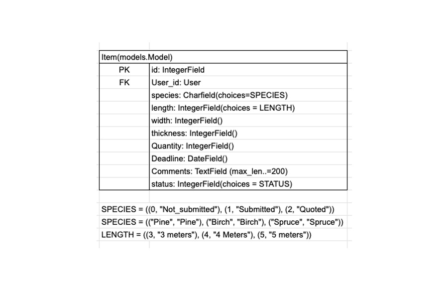

# Sustainable Timber Co. 

It's time to really celebrate and support businesses that have the environment at the heart of their products. Sustainable Timber Co. is owned and run by Johan Johansson, a highly creative person with a small forest and sawmill.

For Johan the nature is important and every tree has a story. Based in the north of Swedish, his method of forestry ensures that the nature remains unharmed and that every tree removed is removed for a good reason. As a result Johan only removes a small number of trees each year and the price of those trees must be of a premium. 

Johan is able to custom mill the trees to exactly what his customers require. Customers like instrument builders, furniture makers and timber-frame house renovators. 

Johan is part of the team. Solving a problem for his customers. What better way to do this than a custom built online enquiry system that allows users to specifically detail what they need and when they need it. Giving Johan the information he needs to really offer his customers a unique and premium experience.  

Design Thinking

### Video Proposal
I created a proposal video. This would be presented to owners or investors.

### The company
This is based on a real-life company in the North of Sweden. For these small sawmills it is currently hard for them to connect with customers, without having a custom made website and backend. Often enquires and communications are done via Facebook or some-kind of primitive local online market place. 

### Knowing the customer
I spoke with a number of people that worked with wood. Daniel and Niklas stood out as the kind of people that would use a custom milled timber company. 

There results are below, with keywords highlighted in red text.

### Persona 
The projects - Persona

### Brainstorm
Brain Storm 1 - General ideas for the website

Brain Storm 2 - Focusing in on viable ideas

### Wireframes
Below is an example of my original wireframes for this project. You can see that the final website evolved from these first concepts of how the website would look.

### Planning & Design
My original plan was to use two databases. One containing quotes and the other containing items that would sit within quotes. Allowing the user to request a number of items within a single quote.

After trying this in production I came across the problem of tieing together the quote ID to the Items database. This felt a little too advanced for this project as so I simplified the idea to one database. The user could still make multiple enquires, but it would be contained in one database. This felt more realistic given my skill level and the time allocated for the project.

Below is the database model I switched to using for the project.

Agile

User Stories & Agile

I generated over 100 user stories in the development of this project. I made use of the 'project' feature within GitHub to manage the ordering and completion. 

[Link to the Github Project used in this project](https://github.com/users/andrewcargill/projects/7)

User Stories were very useful during development as they allowed me to closely track progress. I discovered that using tick-boxes for each 'task' really helped monitor the completion of a user story.

Story Points & Sprints

My allocation and valuing of story points moved a little as the project progressed. I completed my first sprint and re-assessed the value of 1 story point - After the first week of development I was confident on the value of one story point. For me this was a User Story that I knew how to complete and required little background research. 

Sprint lengths changed depending on my work/ study hours for that day or week of production. This would be much easier with a standard 40hr week, but I did feel that it was useful to apply sprints to my work even when working alone and studying as I do, as it helped me set goals for sections of the projects development.

Epics into User Stories

Below is an example of how I turned an epic into User Stories. 

| Epic       | User Stories          |
| ------------- |-------------|
| [Final Design - EPIC](https://github.com/andrewcargill/johans_eco_timber/issues/44)    | [Calendar](https://github.com/andrewcargill/johans_eco_timber/issues/80)  |
||[Redirect on login](https://github.com/andrewcargill/johans_eco_timber/issues/77)    |
||[Hero Image text](https://github.com/andrewcargill/johans_eco_timber/issues/72)    |
||[Optimal image sizes](https://github.com/andrewcargill/johans_eco_timber/issues/73)    |
||[Copyright icon](https://github.com/andrewcargill/johans_eco_timber/issues/74)    |
||[Fix mobile design for specific pages](https://github.com/andrewcargill/johans_eco_timber/issues/75)    |
||[Change 'register' to 'signup'](https://github.com/andrewcargill/johans_eco_timber/issues/76)    |
||[Capitalize user name when displayed](https://github.com/andrewcargill/johans_eco_timber/issues/78)    |
||[Explore information container background color](https://github.com/andrewcargill/johans_eco_timber/issues/79)    |
||[Align Navigation](https://github.com/andrewcargill/johans_eco_timber/issues/45)    |
||[Navigation fixed to top of screen](https://github.com/andrewcargill/johans_eco_timber/issues/70)    |
||[Favicon](https://github.com/andrewcargill/johans_eco_timber/issues/33)    |

Features

### Existing Features

Navigation

- Responsive design
- Displays custom menu for logged in user
- Display custom menu for Admin (Superuser)
- Displays status of user login - logged out

Website

- Responsive design
- Simple information
- Clearly displaying 'Johan' to build customer trust

Enquiry System

- Responsive design
- User can create an enquiry
- User can edit an enquiry
- User can submit an enquiry
- User can delete an enquiry
- Admin can update the status to 'emailed'. This will reflect in users view

### Future Features

Testing

Manual Testing 

| Page        | Description           | Result  |
| ------------- |-------------| -----|
| Index.html    | About button | Pass |
|      | Responsive Design - Mobile > Large      |   Pass |
|      | Hello, I'm Johan Link      |   Pass |
|  | True Sustainable Forestry Link      |Pass |
||How I can help... Link|Pass|
||Take only the trees... Link|Pass|
||That creatuve... link|Pass|
|About|Responsive design - Mobile > Large|Pass|
||Link test|Pass|
|Forest|Responsive Design - Mobile > Large|Pass|
||Link test|Pass|
|Customer Timber|Responsive Design - Mobile > Large|Pass|
||Link test|Pass|
|Login|Log in with Username & Password|Pass|
||Login with incorrect details (help text)|Pass|
||Link to 'sign up' test |Pass|
||Successful login - User to 'quote_list' with username displayed |Pass|
||Successful login - Admin to 'quote_list' with username displayed |Pass|
|Sign up| Sign up with correct information |Pass|
||Sign up with incorrect info (help text)|Pass|
||Test 'sign in' link|Pass|
|Enquiry (list view)|Responsive Design - Mobile > Large|Pass|
||New enquiry button loads new enquiry form|Pass|
||Sign out button loads sign out confirmation view|Pass|
||(Unsubmitted) Delete button loads delete confirmation view|Pass|
||(Submitted) Delete button loads delete confirmation view|Pass|
||(Email sent) Delete button loads delete confirmation view|Pass|
||Scrolling for many items|Pass|
|New Enquiry form|Responsive Design - Mobile > Large|Pass|
||Completed form - submit button - saves and loads list view|Pass|
||Uncompleted form - submit button - help text shown|Pass|
||Cancel button - User returned to list view|Pass|
||Datepicker - Loads when clicked|Pass|
||Number fields - Only except numbers|Pass|
||Comment field allows for large string|Pass|
|Submit form view|Responsive Design - Mobile > Large|Pass|
||Displayed details match the record being submitted|Pass|
||Submit button - changes status of enquiry and loads list view|Pass|
||Cancel button - Enquiry remains unsubmitted - loads list view|Pass|
|Delete view|Responsive Design - Mobile > Large|Pass|
||Delete button - Loads list view and removes the enquiry|Pass|
||Cancel button - Loads list view and enquiry remains in list|Pass|
|Edit Enquiry|Responsive Design - Mobile > Large|Pass|
||Save changes button updates enquiry|Pass|
||Cancel button returns user to list view|Pass|
||Incorrect changes - Help text shown|Pass|
|Alert Box|Alert shown after enquiry saved|Pass|
||Alert shown after enquiry edited|Pass|
||Alert shown after enquiry submitted|Pass|
||Alert shown after user logs out|Pass|
|User status|Not shown when user is not logged in|Pass|
||Displays users name when logged in|Pass|
||Confirms user has logged out - after logout|Pass|
|Navigation|Responsive Design - Mobile > Large|Pass|
||Home links to index.html|Pass|
||About links to about.html|Pass|
||Out forest links to outforest.html|Pass|
||Custom timber links to about_enquiry_system.html|Pass|
||Login links to accounts/login/|Pass|
||Sign up links to /accounts/signup/|Pass|
||User Logged in - Enquires links to quote_list.html|Pass|
||User logged in - New Enquiry links to new_enquiry.html|Pass|
||User logged in - Log out links to accounts/logout/|Pass|
||Admin logged in -Admin control panel links to /admin |Pass|
||Admin logged in - Log out links to accounts/logout/|Pass|
|Admin view|Admin changes status to emailed - Updates list view|Pass|

Automated Testing

Xxx

Bugs

### Solved

Bootstrap & Materialize

I had zero experience on these and as both were used in the walkthroughs I thought they were equals. I went with Materialise. This backfired when I was trying to work out forms as I was informed by a tutor that Materialise was seen as very dated and that I would experience problems with Django should I choice to continue working with it. 

As this project involves many elements I found that I didn’t really have the time to focus and learn the true powers of Bootstrap. For this project it is used on a basic level.

Power of Agile - A change of direction

I needed to change direction on the enquiry system implementation. My original plan was to allow the user to create an enquiry, add a number of items to the enquiry and then submit the enquiry. At the stage where I had the database models installed and was trying to solve the problem of including items within the enquiry I realised that this was maybe a little ambitious for this project. 

I decided to simplify the idea into one database and enable the user to create an enquiry and then submit the enquiry. The system would allow the user to create and submit any number of enquires. 

Deployment

I spent 3 hours working with Rebecca (Tutor) to help me get the site live. 

### Unsolved

Styling of Sign up

I just ran out of time!

Selecting deadline date

There should be an error if a user selects a date which is in the past. I looked into solving this but I felt I just didn't have the time to do it. 

Another

Xxx

Deployment

### Deploying to Heroku
### Database setup
### Cloudinary

Credit & Acknowledgements

### Credits
### Acknowledgements

